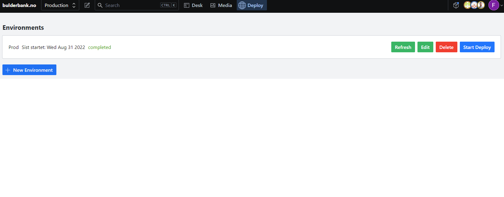
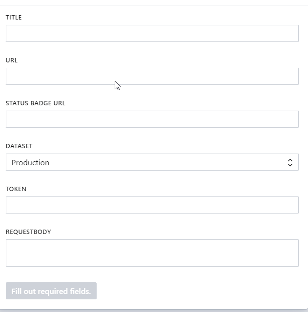

# sanity-plugin-github-workflow

Simple tab to manually trigger github workflows




## Installation

```
sanity install webhook-github-workflow
```

## License

MIT © Gardener NYC LLC
See LICENSE
